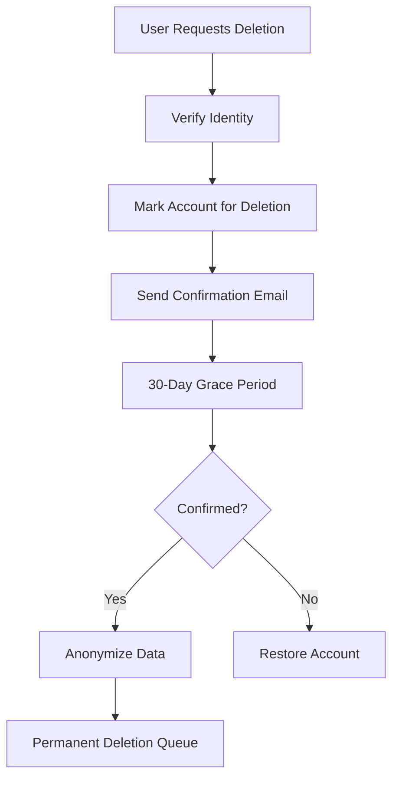

# Data Lifecycle Management

## Overview
This document outlines the policies and procedures for managing data throughout its lifecycle in the mgmt-vibe platform, ensuring compliance with privacy regulations and efficient data management.

## Data Classification

### Data Categories

#### Personal Data (PII)
- **User Profiles**: Names, email addresses, phone numbers
- **Appointment Data**: Customer contact information, service details
- **Communication Records**: Chat logs, support tickets
- **Payment Information**: Billing details, transaction records

#### Business Data
- **Service Information**: Service descriptions, pricing, availability
- **Staff Records**: Employee information, schedules
- **Analytics Data**: Usage statistics, performance metrics
- **Audit Logs**: Security events, access records

#### System Data
- **Configuration**: Application settings, environment variables
- **Logs**: Application logs, error reports
- **Backups**: Database backups, configuration backups
- **Temporary Files**: Cache data, session files

### Data Sensitivity Levels

#### Critical
- Customer PII
- Financial transaction data
- Health information (if applicable)
- Authentication credentials

#### High
- Business financial data
- Employee PII
- Intellectual property
- Security audit logs

#### Medium
- Operational logs
- Performance metrics
- Non-sensitive customer data
- Internal communications

#### Low
- Public service information
- Marketing materials
- System configuration
- Temporary cache data

## Data Retention Policies

### Personal Data Retention

#### User Account Data
- **Active Accounts**: Retained indefinitely while account is active
- **Inactive Accounts**: Retained for 7 years after last activity
- **Deleted Accounts**: Anonymized after 30 days, permanently deleted after 7 years
- **Legal Holds**: Data preserved during active legal proceedings

#### Appointment and Service Data
- **Active Appointments**: Retained indefinitely for service history
- **Completed Appointments**: Retained for 7 years for tax and legal purposes
- **Customer Communications**: Retained for 3 years or until customer deletion request

#### Payment Data
- **Transaction Records**: Retained for 7 years for tax compliance
- **Payment Methods**: Tokenized data retained per PCI DSS requirements
- **Refund Records**: Retained for 7 years matching transaction retention

### Business Data Retention

#### Operational Data
- **Service Configurations**: Retained indefinitely
- **Staff Records**: Retained for 7 years after employment ends
- **Analytics Data**: Aggregated data retained indefinitely, raw data for 2 years

#### Audit and Security Data
- **Access Logs**: Retained for 7 years
- **Security Events**: Retained for 7 years
- **Incident Reports**: Retained indefinitely
- **Audit Trails**: Retained for 7 years

### System Data Retention

#### Application Logs
- **Error Logs**: Retained for 90 days
- **Access Logs**: Retained for 7 years
- **Performance Logs**: Retained for 2 years
- **Debug Logs**: Retained for 30 days

#### Database Backups
- **Daily Backups**: Retained for 30 days
- **Weekly Backups**: Retained for 6 months
- **Monthly Backups**: Retained for 7 years
- **Yearly Backups**: Retained indefinitely

## Data Deletion Procedures

### User-Initiated Deletion

#### Account Deletion Request


1. **Request Submission**: User submits deletion request through application
2. **Identity Verification**: Confirm user identity through email or MFA
3. **Grace Period**: 30-day waiting period for user reconsideration
4. **Data Anonymization**: Replace PII with anonymous identifiers
5. **Permanent Deletion**: Remove anonymized data after retention period

#### Right to Be Forgotten (GDPR)
- **Scope**: All personal data related to the individual
- **Timeline**: Complete within 30 days of request
- **Verification**: Strong identity verification required
- **Notification**: Confirmation of deletion completion

### Automated Deletion

#### Scheduled Cleanup Jobs
```bash
# Daily cleanup job
#!/bin/bash
# Remove expired sessions
psql "$DATABASE_URL" -c "DELETE FROM sessions WHERE expires_at < NOW();"

# Anonymize old user data
psql "$DATABASE_URL" -c "
  UPDATE users
  SET email = CONCAT('deleted-', id, '@anonymous.local'),
      phone = NULL,
      name = 'Deleted User'
  WHERE deleted_at < NOW() - INTERVAL '30 days'
  AND deletion_confirmed = true;
"

# Remove old logs
find /var/log/mgmt-vibe -name "*.log" -mtime +90 -delete

# Clean up temporary files
find /tmp/mgmt-vibe -mtime +7 -delete
```

#### Retention Policy Enforcement
- **Automated Jobs**: Run daily to enforce retention policies
- **Manual Reviews**: Quarterly review of retention compliance
- **Audit Logging**: All deletion activities logged and auditable

## Data Export Procedures

### User Data Export

#### GDPR Data Portability
```bash
# Generate user data export
curl -X POST https://api.mgmt-vibe.com/api/user/export \
  -H "Authorization: Bearer $USER_TOKEN" \
  -H "Content-Type: application/json" \
  -d '{
    "format": "json",
    "include": ["profile", "appointments", "payments", "communications"]
  }'
```

**Export Contents:**
- Personal profile information
- Appointment history
- Payment transaction history
- Communication records
- Service preferences

**Export Formats:**
- JSON (machine-readable)
- CSV (spreadsheet-compatible)
- PDF (human-readable)

#### Export Timeline
- **Request Processing**: Within 30 days of request
- **Data Collection**: Automated extraction from all systems
- **Format Conversion**: Convert to requested format
- **Secure Delivery**: Encrypted download link or secure email

### Business Data Export

#### Analytics Data Export
```bash
# Export business analytics
curl -X GET "https://api.mgmt-vibe.com/api/admin/analytics/export?start_date=2024-01-01&end_date=2024-12-31" \
  -H "Authorization: Bearer $ADMIN_TOKEN" \
  -o business_analytics_2024.zip
```

#### Compliance Exports
- **Regulatory Requests**: Export data for legal or regulatory requirements
- **Audit Reports**: Generate compliance reports and evidence
- **Business Intelligence**: Export data for analysis and reporting

## Data Archival Procedures

### Long-Term Archival
```bash
# Archive old data to cold storage
#!/bin/bash

# Create archive directory
ARCHIVE_DIR="/archive/$(date +%Y%m%d)"
mkdir -p "$ARCHIVE_DIR"

# Export old appointment data
psql "$DATABASE_URL" -c "
  COPY (
    SELECT * FROM appointments
    WHERE created_at < NOW() - INTERVAL '7 years'
  ) TO '$ARCHIVE_DIR/appointments.csv' WITH CSV HEADER;
"

# Compress and encrypt archive
tar -czf "$ARCHIVE_DIR.tar.gz" "$ARCHIVE_DIR"
gpg --encrypt --recipient archive-key "$ARCHIVE_DIR.tar.gz"

# Upload to cloud storage
aws s3 cp "$ARCHIVE_DIR.tar.gz.gpg" "s3://mgmt-vibe-archive/$(basename $ARCHIVE_DIR.tar.gz.gpg)"

# Clean up local files
rm -rf "$ARCHIVE_DIR" "$ARCHIVE_DIR.tar.gz" "$ARCHIVE_DIR.tar.gz.gpg"
```

### Archive Access Procedures
- **Access Requests**: Require business justification and approval
- **Decryption Process**: Secure key management for encrypted archives
- **Audit Logging**: All archive access activities logged
- **Retention**: Archives retained according to data classification requirements

## Privacy and Compliance

### GDPR Compliance

#### Data Processing Inventory
- **Personal Data Mapping**: Complete inventory of all personal data processing
- **Legal Basis Documentation**: Document legal basis for each data processing activity
- **Data Flow Diagrams**: Visual representation of data movement and storage

#### Privacy Rights Implementation
- **Access Right**: Users can request copies of their personal data
- **Rectification Right**: Users can correct inaccurate personal data
- **Erasure Right**: Users can request deletion of their personal data
- **Restriction Right**: Users can limit processing of their personal data
- **Portability Right**: Users can obtain their data in machine-readable format

### Data Protection Measures

#### Encryption at Rest
```yaml
# Kubernetes secret for encryption keys
apiVersion: v1
kind: Secret
metadata:
  name: encryption-keys
  namespace: mgmt-vibe
type: Opaque
data:
  database-key: <base64-encoded-key>
  file-encryption-key: <base64-encoded-key>
```

#### Encryption in Transit
- **TLS 1.3**: All external communications use TLS 1.3
- **Internal Encryption**: Service mesh encryption for internal communications
- **API Security**: All API endpoints require HTTPS

#### Data Masking and Anonymization
```sql
-- Anonymize user data for analytics
CREATE VIEW user_analytics AS
SELECT
  id,
  CONCAT('User-', RIGHT(MD5(email), 8)) as anonymous_id,
  created_at,
  last_login_at,
  -- No PII in analytics views
FROM users
WHERE deleted_at IS NULL;
```

## Data Quality Management

### Data Validation Rules
- **Input Validation**: Real-time validation of data entry
- **Business Rules**: Automated checks for business logic compliance
- **Cross-Reference Validation**: Ensure data consistency across systems

### Data Quality Monitoring
```sql
-- Monitor data quality metrics
SELECT
  'duplicate_emails' as metric,
  COUNT(*) as value
FROM (
  SELECT email, COUNT(*)
  FROM users
  WHERE email IS NOT NULL
  GROUP BY email
  HAVING COUNT(*) > 1
) duplicates

UNION ALL

SELECT
  'incomplete_profiles' as metric,
  COUNT(*) as value
FROM users
WHERE name IS NULL OR email IS NULL

UNION ALL

SELECT
  'orphaned_appointments' as metric,
  COUNT(*) as value
FROM appointments a
LEFT JOIN users u ON a.customer_id = u.id
WHERE u.id IS NULL;
```

## Incident Response Data Handling

### Data Breach Procedures
1. **Containment**: Immediately contain the breach
2. **Assessment**: Determine scope and impact of breached data
3. **Notification**: Notify affected individuals and authorities within required timelines
4. **Recovery**: Restore systems and validate data integrity
5. **Prevention**: Implement additional security measures

### Data Recovery Validation
```bash
# Validate backup integrity
pg_restore --list backup_file.sql > /dev/null

# Check data consistency
psql "$DATABASE_URL" -c "
  SELECT
    schemaname,
    tablename,
    n_tup_ins,
    n_tup_upd,
    n_tup_del
  FROM pg_stat_user_tables
  ORDER BY n_tup_ins + n_tup_upd + n_tup_del DESC
  LIMIT 10;
"

# Verify referential integrity
psql "$DATABASE_URL" -c "
  SELECT COUNT(*) as orphaned_records
  FROM appointments a
  LEFT JOIN users u ON a.customer_id = u.id
  WHERE u.id IS NULL;
"
```

## Audit and Monitoring

### Data Lifecycle Auditing
- **Access Logging**: All data access activities logged
- **Change Tracking**: Database change tracking enabled
- **Retention Compliance**: Automated checks for retention policy compliance
- **Deletion Auditing**: All data deletion activities recorded

### Compliance Reporting
```sql
-- Generate compliance report
SELECT
  'data_retention_compliance' as check_name,
  CASE
    WHEN COUNT(*) = 0 THEN 'PASS'
    ELSE 'FAIL'
  END as status,
  COUNT(*) as violations,
  'No data older than retention period found' as description
FROM users
WHERE created_at < NOW() - INTERVAL '7 years'
  AND deleted_at IS NULL

UNION ALL

SELECT
  'data_deletion_compliance' as check_name,
  CASE
    WHEN COUNT(*) = 0 THEN 'PASS'
    ELSE 'FAIL'
  END as status,
  COUNT(*) as violations,
  'All deleted data properly anonymized' as description
FROM users
WHERE deleted_at < NOW() - INTERVAL '30 days'
  AND deletion_confirmed = true
  AND (email NOT LIKE 'deleted-%' OR phone IS NOT NULL);
```

## Training and Awareness

### Data Handling Training
- **Privacy Training**: Annual GDPR and privacy training for all employees
- **Data Classification**: Training on data classification and handling requirements
- **Incident Response**: Data breach response training and simulations

### Policy Communication
- **Regular Updates**: Quarterly communication of data policy changes
- **Documentation Access**: All policies available in employee handbook
- **Help Resources**: Data protection officer available for questions

---

**Last Updated**: [Date]
**Document Owner**: [Data Protection Officer]
**Review Frequency**: Annual
