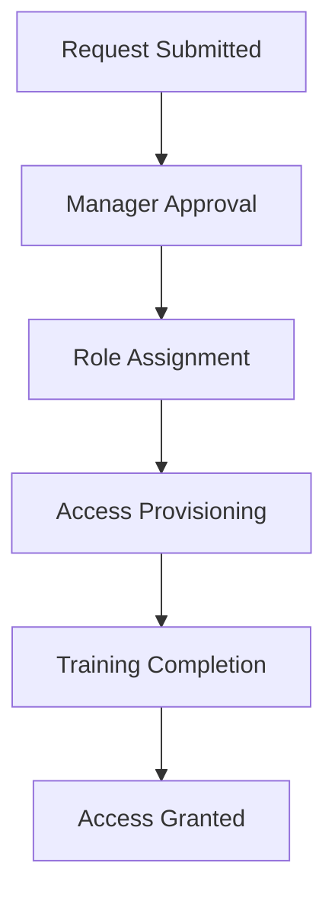
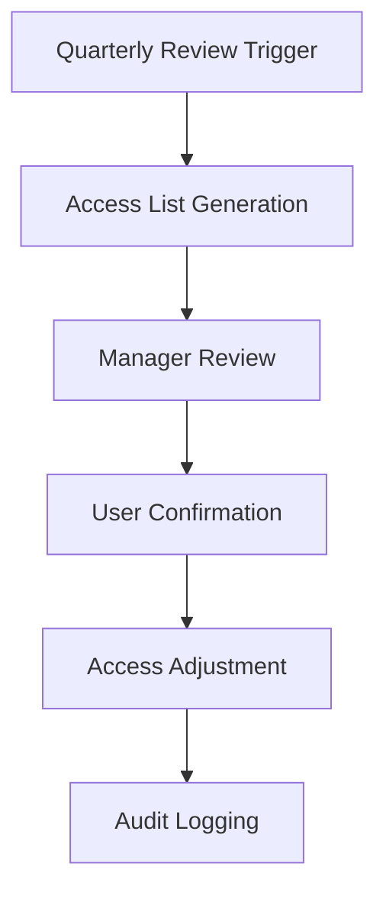
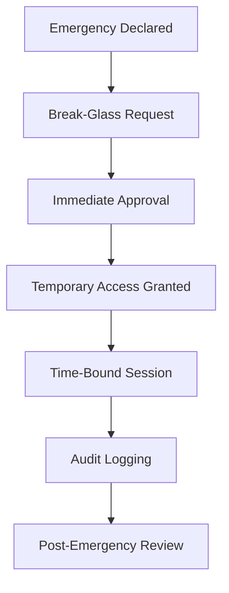

# IAM and Access Management

## Overview
This document outlines the Identity and Access Management (IAM) policies, role-based access controls, and procedures for maintaining security and compliance in the mgmt-vibe platform.

## Access Control Principles

### Least Privilege
- Users receive minimum permissions required for their job functions
- Permissions are regularly reviewed and revoked when no longer needed
- Access is granted on a case-by-case basis with business justification

### Role-Based Access Control (RBAC)
- Access is assigned based on job roles and responsibilities
- Roles are predefined with specific permission sets
- Role assignments require manager approval

### Zero Trust Architecture
- No implicit trust in any user or system
- All access requests are authenticated and authorized
- Continuous verification of identity and context

## User Roles and Permissions

### Development Team Roles

#### Developer
**Permissions:**
- Read access to all repositories
- Write access to development branches
- Deploy to staging environment
- Access to development databases
- Read-only access to production logs

**Responsibilities:**
- Code development and testing
- Bug fixes and feature development
- Participation in code reviews

#### Senior Developer
**Permissions:** (All Developer permissions plus)
- Write access to main branch (with PR approval)
- Deploy to production (with approval)
- Access to production databases (read-only)
- Access to infrastructure monitoring

**Responsibilities:** (All Developer responsibilities plus)
- Code review approval authority
- Incident response participation
- Mentoring junior developers

#### Engineering Manager
**Permissions:** (All Senior Developer permissions plus)
- Admin access to repositories
- Full infrastructure access
- Access to all databases
- Access to security monitoring
- User access management

**Responsibilities:** (All Senior Developer responsibilities plus)
- Team management and planning
- Security incident oversight
- Access approval authority

### Operations Team Roles

#### DevOps Engineer
**Permissions:**
- Full infrastructure access
- Database administration
- CI/CD pipeline management
- Monitoring system configuration
- Deployment execution

**Responsibilities:**
- Infrastructure maintenance
- Deployment automation
- Monitoring and alerting
- Incident response

#### Site Reliability Engineer (SRE)
**Permissions:** (All DevOps permissions plus)
- Production system administration
- Emergency access procedures
- Security monitoring access

**Responsibilities:** (All DevOps responsibilities plus)
- System reliability and performance
- Incident management
- Disaster recovery coordination

### Security Team Roles

#### Security Engineer
**Permissions:**
- Read access to all systems and data
- Security monitoring and alerting
- Vulnerability scanning systems
- Access to security audit logs

**Responsibilities:**
- Security monitoring and response
- Vulnerability assessments
- Security tool maintenance
- Compliance monitoring

#### Security Manager
**Permissions:** (All Security Engineer permissions plus)
- Security policy management
- Access control administration
- Incident investigation authority

**Responsibilities:** (All Security Engineer responsibilities plus)
- Security strategy and planning
- Team leadership and training
- Compliance reporting

## Access Management Procedures

### New User Onboarding


1. **Access Request**: User submits request with business justification
2. **Manager Approval**: Direct manager reviews and approves
3. **Role Assignment**: Security team assigns appropriate role
4. **Access Provisioning**: Automated provisioning of required access
5. **Security Training**: Completion of required security training
6. **Access Granted**: User notified and can begin work

### Access Review Process


- **Frequency**: Quarterly access reviews
- **Scope**: All user access and permissions
- **Process**: Automated reports, manager review, user confirmation
- **Documentation**: All changes logged and auditable

### Access Revocation
- **Immediate Revocation**: For terminated employees or security incidents
- **Automatic Processes**: Disable accounts, revoke tokens, update access lists
- **Notification**: User and manager notified of revocation
- **Audit Trail**: Complete logging of revocation process

## Break-Glass Procedures

### Emergency Access Overview
Break-glass procedures provide temporary elevated access for emergency situations where normal approval processes cannot be followed.

### Emergency Access Criteria
- **System Down**: Complete system outage requiring immediate access
- **Security Incident**: Active security breach requiring investigation
- **Data Loss**: Critical data loss requiring immediate recovery
- **Compliance**: Regulatory requirements mandating immediate action

### Break-Glass Request Process


1. **Emergency Declaration**: Incident commander declares emergency
2. **Request Submission**: Engineer requests break-glass access with justification
3. **Immediate Approval**: Security or engineering manager approves
4. **Access Provisioning**: Temporary elevated permissions granted
5. **Time Limits**: Access automatically expires (maximum 4 hours)
6. **Full Audit**: All actions logged and recorded
7. **Post-Review**: Incident review includes break-glass usage

### Break-Glass Access Levels

#### Level 1: Read-Only Emergency
- **Duration**: Up to 24 hours
- **Permissions**: Read access to all systems and logs
- **Approval**: Engineering manager or above
- **Use Case**: Investigation and assessment

#### Level 2: Limited Write Access
- **Duration**: Up to 4 hours
- **Permissions**: Write access to specific systems
- **Approval**: VP Engineering or CISO
- **Use Case**: Critical fixes and recovery

#### Level 3: Full Administrative Access
- **Duration**: Up to 1 hour
- **Permissions**: Full system administration
- **Approval**: CEO or designated emergency contact
- **Use Case**: Catastrophic failure requiring full access

### Break-Glass Implementation
```bash
# Request break-glass access
curl -X POST https://api.mgmt-vibe.com/admin/break-glass \
  -H "Authorization: Bearer $USER_TOKEN" \
  -H "Content-Type: application/json" \
  -d '{
    "level": 2,
    "justification": "Database corruption during incident INC-123",
    "duration_hours": 2,
    "systems": ["database", "monitoring"]
  }'

# Response includes temporary credentials and expiration time
{
  "request_id": "bg-20241115-001",
  "status": "approved",
  "credentials": {
    "token": "temp-token-xxx",
    "expires_at": "2024-11-15T14:30:00Z"
  },
  "permissions": ["database:admin", "monitoring:read"]
}
```

### Break-Glass Monitoring
- **Automatic Alerts**: Security team notified of break-glass activation
- **Session Recording**: All break-glass sessions recorded
- **Time Limits**: Automatic expiration prevents indefinite access
- **Audit Reports**: Detailed logs of all break-glass activities

## Multi-Factor Authentication (MFA)

### MFA Requirements
- **All Users**: Required for all user accounts
- **Administrative Access**: Hardware security keys recommended
- **Emergency Access**: MFA required even for break-glass procedures

### MFA Implementation
```bash
# Enable MFA for user
curl -X POST https://api.mgmt-vibe.com/auth/mfa/enable \
  -H "Authorization: Bearer $USER_TOKEN"

# Verify MFA during login
curl -X POST https://api.mgmt-vibe.com/auth/login \
  -H "Content-Type: application/json" \
  -d '{
    "username": "user@example.com",
    "password": "password",
    "mfa_code": "123456"
  }'
```

## Access Monitoring and Auditing

### Real-Time Monitoring
- **Login Attempts**: All authentication events logged
- **Permission Changes**: Access modifications tracked
- **Suspicious Activity**: Automated detection of anomalous access patterns
- **Geographic Monitoring**: Access from unusual locations flagged

### Audit Logging
```json
{
  "timestamp": "2024-11-15T10:30:00Z",
  "event_type": "access_granted",
  "user_id": "user-123",
  "resource": "database:production",
  "action": "read",
  "ip_address": "192.168.1.100",
  "user_agent": "Mozilla/5.0...",
  "justification": "Database performance investigation",
  "approved_by": "manager-456",
  "session_id": "session-789"
}
```

### Regular Audits
- **Monthly Reports**: Access patterns and anomalies reviewed
- **Quarterly Audits**: Full access review and certification
- **Annual Assessments**: Comprehensive security and compliance audits
- **Incident Reviews**: Access-related incidents analyzed

## Third-Party Access Management

### Vendor Access
- **Justification Required**: All vendor access must be business-justified
- **Time-Limited**: Vendor access expires automatically
- **Monitored**: All vendor actions logged and audited
- **Approval Process**: Security review required for sensitive access

### API Access
- **OAuth 2.0**: All API access uses OAuth 2.0 with JWT tokens
- **Scopes**: Fine-grained permission scopes for API access
- **Rate Limiting**: API access rate limited and monitored
- **Token Rotation**: Regular token rotation policies

## Compliance and Reporting

### Regulatory Compliance
- **GDPR**: Data access logging and audit trails
- **SOC 2**: Access control and monitoring requirements
- **ISO 27001**: Information security management standards
- **Industry Standards**: Healthcare, finance, or other industry requirements

### Reporting Requirements
- **Access Reports**: Monthly reports on user access and changes
- **Audit Logs**: Comprehensive audit trails for all access events
- **Compliance Reports**: Quarterly compliance status reports
- **Incident Reports**: Access-related security incidents documented

## Security Training and Awareness

### Required Training
- **Annual Security Training**: All employees complete security awareness training
- **Role-Specific Training**: Specialized training for privileged access
- **Incident Response Training**: Hands-on incident response exercises
- **Access Management Training**: Proper use of access management tools

### Training Verification
- [ ] Security awareness training completion
- [ ] Role-specific access training
- [ ] Incident response training
- [ ] Annual training refreshers

## Emergency Contacts and Escalation

### Security Incident Escalation
1. **Immediate Response**: Contact security team lead
2. **Escalation**: VP of Engineering for major incidents
3. **Executive Notification**: CEO for critical security breaches

### Contact Information
- **Security Team Lead**: [Name] - [Phone] - [Email]
- **VP Engineering**: [Name] - [Phone] - [Email]
- **CEO**: [Name] - [Phone] - [Email]
- **External Security Firm**: [Contact] - For advanced threats

## Continuous Improvement

### Access Management Metrics
- **Access Request Time**: Average time to provision access
- **Review Completion Rate**: Percentage of timely access reviews
- **Incident Response Time**: Time to respond to access incidents
- **Audit Finding Rate**: Number of access control issues found

### Process Improvements
- **Automation**: Implement automated provisioning and deprovisioning
- **Self-Service**: Allow users to request access through approved workflows
- **Analytics**: Use access patterns to optimize permission models
- **Feedback Loops**: Regular surveys and improvement suggestions

---

**Last Updated**: [Date]
**Document Owner**: [Security Team]
**Review Frequency**: Quarterly
