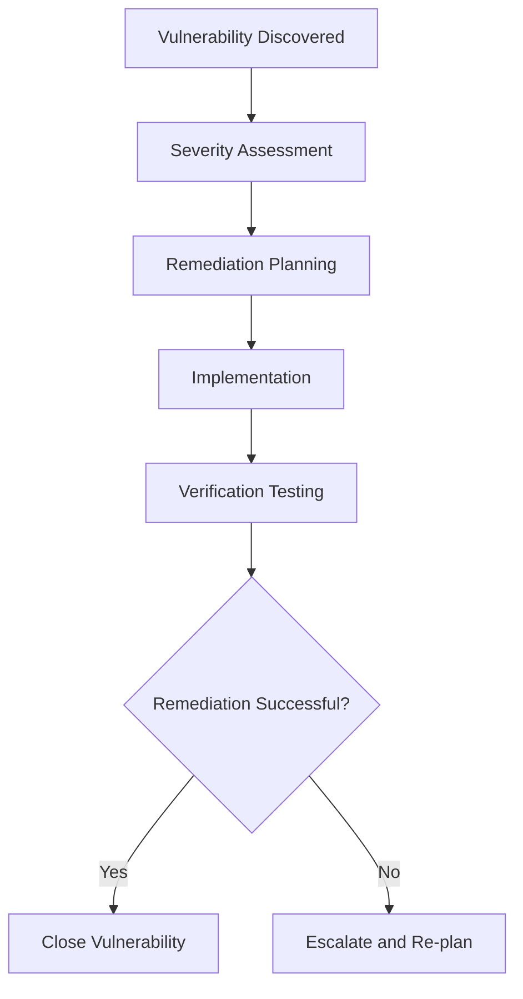

# Security Review and Penetration Testing Checklist

## Overview
This document provides a comprehensive security review checklist and penetration testing procedures required for production deployment of the mgmt-vibe platform.

## Security Assessment Phases

### Phase 1: Automated Security Scanning

#### Dependency Vulnerability Scanning
```bash
# Run npm audit for Node.js dependencies
npm audit --audit-level high

# Check for outdated packages
npm outdated

# Run security linter
npm run lint:security

# Scan for vulnerable dependencies
npm install -g audit-ci
audit-ci --config audit-ci.json
```

#### Container Security Scanning
```bash
# Scan Docker images for vulnerabilities
docker run --rm -v /var/run/docker.sock:/var/run/docker.sock \
  aquasecurity/trivy image ghcr.io/your-org/mgmt-vibe:latest

# Check for secrets in container
docker run --rm -v /path/to/image:/image \
  zricethezav/gitleaks:latest detect --source /image

# Validate container configuration
docker run --rm -v /path/to/dockerfile:/dockerfile \
  hadolint/hadolint:latest /dockerfile
```

#### Infrastructure as Code Security
```bash
# Check Kubernetes manifests
kube-score score k8s/*.yml

# Validate Terraform configurations
terraform validate
tflint

# Security check for CloudFormation (if used)
cfn-lint template.yml
```

### Phase 2: Application Security Testing

#### Static Application Security Testing (SAST)
```bash
# Run SAST tools
npm install -g @shiftleft/scan
scan --local .

# ESLint security rules
npx eslint --config .eslintrc.security.js src/

# TypeScript security analysis
npx ts-security-check
```

#### Dynamic Application Security Testing (DAST)
```bash
# OWASP ZAP automated scan
docker run -t owasp/zap2docker-stable zap-baseline.py \
  -t https://staging.mgmt-vibe.com \
  -r zap-report.html

# Nikto web server scanner
nikto -h https://staging.mgmt-vibe.com

# SQLMap for API endpoints
sqlmap -u "https://api.mgmt-vibe.com/api/users" \
  --batch --crawl=2
```

#### API Security Testing
```bash
# Test authentication bypass
curl -X GET https://api.mgmt-vibe.com/api/admin/users \
  -H "Authorization: Bearer invalid-token"

# Test input validation
curl -X POST https://api.mgmt-vibe.com/api/appointments \
  -H "Content-Type: application/json" \
  -d '{"date": "../../../../etc/passwd"}'

# Test rate limiting
for i in {1..100}; do
  curl -s https://api.mgmt-vibe.com/api/health &
done

# Test CORS configuration
curl -H "Origin: https://evil.com" \
  -H "Access-Control-Request-Method: GET" \
  -X OPTIONS https://api.mgmt-vibe.com/api/users
```

### Phase 3: Infrastructure Security Testing

#### Network Security Testing
```bash
# Port scanning
nmap -sV -p- staging.mgmt-vibe.com

# SSL/TLS configuration testing
ssllabs-scan staging.mgmt-vibe.com
testssl.sh staging.mgmt-vibe.com

# Firewall configuration
nmap -sA staging.mgmt-vibe.com
```

#### Cloud Security Assessment
```bash
# AWS security assessment (if applicable)
scout2 --report-dir scout2-report

# Check IAM permissions
aws iam generate-credential-report
aws iam get-credential-report

# Security group analysis
aws ec2 describe-security-groups
```

## Security Checklist

### Authentication & Authorization

#### [ ] Multi-Factor Authentication (MFA)
- [ ] MFA required for all administrative accounts
- [ ] MFA enforced for production access
- [ ] Hardware security keys supported
- [ ] MFA bypass procedures documented and secured

#### [ ] Password Policies
- [ ] Minimum 12 characters required
- [ ] Complexity requirements enforced
- [ ] Password history prevents reuse
- [ ] Account lockout after failed attempts

#### [ ] Session Management
- [ ] Secure session cookies (HttpOnly, Secure, SameSite)
- [ ] Session timeout configured (30 minutes inactivity)
- [ ] Concurrent session limits enforced
- [ ] Session invalidation on logout

#### [ ] Authorization Controls
- [ ] Role-based access control (RBAC) implemented
- [ ] Least privilege principle applied
- [ ] API endpoint authorization verified
- [ ] Administrative function restrictions

### Data Protection

#### [ ] Encryption at Rest
- [ ] Database encryption enabled
- [ ] File storage encryption configured
- [ ] Backup encryption implemented
- [ ] Secret management system used

#### [ ] Encryption in Transit
- [ ] TLS 1.3 enforced for all connections
- [ ] Certificate validation enabled
- [ ] HSTS headers configured
- [ ] Secure cookie flags set

#### [ ] Data Classification
- [ ] Personal data identified and labeled
- [ ] Data retention policies defined
- [ ] Data deletion procedures implemented
- [ ] Privacy rights (GDPR/CCPA) supported

### Network Security

#### [ ] Firewall Configuration
- [ ] Web Application Firewall (WAF) enabled
- [ ] Default deny policy implemented
- [ ] Required ports only exposed
- [ ] Network segmentation applied

#### [ ] API Security
- [ ] Input validation and sanitization
- [ ] SQL injection prevention
- [ ] XSS protection implemented
- [ ] CSRF protection enabled

#### [ ] DDoS Protection
- [ ] Rate limiting configured
- [ ] CDN DDoS protection enabled
- [ ] Application-level DDoS protection
- [ ] Monitoring and alerting for attacks

### Infrastructure Security

#### [ ] Container Security
- [ ] Non-root user execution
- [ ] Minimal base images used
- [ ] Security scanning passed
- [ ] Runtime security enabled

#### [ ] Kubernetes Security
- [ ] RBAC enabled
- [ ] Pod security policies applied
- [ ] Network policies configured
- [ ] Secrets encrypted at rest

#### [ ] Cloud Security
- [ ] IAM least privilege applied
- [ ] Resource encryption enabled
- [ ] Security groups hardened
- [ ] CloudTrail/audit logging enabled

### Monitoring & Incident Response

#### [ ] Security Monitoring
- [ ] Intrusion detection system active
- [ ] Log aggregation and analysis
- [ ] Security event alerting
- [ ] Threat intelligence integration

#### [ ] Incident Response
- [ ] Incident response plan documented
- [ ] Contact lists maintained
- [ ] Communication procedures defined
- [ ] Post-incident review process

## Penetration Testing Scenarios

### External Penetration Testing
```bash
# Reconnaissance
# - Domain enumeration
# - Subdomain discovery
# - Technology stack identification

# Vulnerability Scanning
# - Port scanning and service enumeration
# - Vulnerability assessment
# - Web application scanning

# Exploitation Attempts
# - SQL injection testing
# - XSS testing
# - Authentication bypass attempts
# - API abuse testing
```

### Internal Network Testing
```bash
# Network reconnaissance
# - Internal network mapping
# - Service discovery
# - Vulnerability scanning

# Privilege escalation
# - Local privilege escalation attempts
# - Service account compromise
# - Container escape testing

# Lateral movement
# - Network pivoting
# - Credential harvesting
# - Database access testing
```

### API Testing
```bash
# Authentication testing
# - Token replay attacks
# - JWT manipulation
# - OAuth flow abuse

# Authorization testing
# - IDOR (Insecure Direct Object References)
# - Privilege escalation
# - Mass assignment vulnerabilities

# Input validation
# - Injection attacks (SQL, NoSQL, Command)
# - Deserialization attacks
# - File upload vulnerabilities
```

## Compliance Validation

### GDPR Compliance Checklist
- [ ] Data processing inventory complete
- [ ] Legal basis documented for each data type
- [ ] Data subject rights implemented (access, rectification, erasure)
- [ ] Data breach notification procedures
- [ ] Privacy by design principles applied

### SOC 2 Compliance Checklist
- [ ] Security policies documented and implemented
- [ ] Access controls and monitoring in place
- [ ] Change management processes defined
- [ ] Incident response procedures documented
- [ ] Business continuity planning completed

### PCI DSS Compliance (if handling payments)
- [ ] Cardholder data environment segmented
- [ ] Encryption of cardholder data
- [ ] Secure authentication procedures
- [ ] Regular security testing
- [ ] Security monitoring and alerting

## Automated Security Testing

### CI/CD Security Gates
```yaml
# .github/workflows/security.yml
name: Security Checks
on: [push, pull_request]

jobs:
  security:
    runs-on: ubuntu-latest
    steps:
      - uses: actions/checkout@v4

      - name: Run Security Scan
        uses: github/super-linter/slim@v5
        env:
          VALIDATE_ALL_CODEBASE: false
          VALIDATE_JAVASCRIPT_ES: true
          VALIDATE_TYPESCRIPT_ES: true

      - name: Dependency Check
        run: npm audit --audit-level high

      - name: Secret Scanning
        uses: gitleaks/gitleaks-action@v2

      - name: Container Scan
        uses: aquasecurity/trivy-action@master
        with:
          scan-type: 'image'
          scan-ref: 'ghcr.io/your-org/mgmt-vibe:latest'
```

### Security Test Automation
```bash
# Automated security regression tests
npm run test:security

# API security tests
npm run test:api-security

# Infrastructure security validation
npm run test:infra-security

# Compliance validation
npm run test:compliance
```

## Remediation and Retesting

### Vulnerability Management Process


### Risk Acceptance Process
For vulnerabilities that cannot be immediately remediated:
- Risk assessment completed
- Mitigation controls documented
- Timeline for remediation established
- Regular review schedule set
- Stakeholder approval obtained

## Security Review Sign-Off

### Pre-Production Security Review
- [ ] All automated security tests passing
- [ ] Critical vulnerabilities remediated
- [ ] Penetration testing completed with acceptable findings
- [ ] Security monitoring and alerting configured
- [ ] Incident response procedures documented and tested

### Final Security Approval
```markdown
# Security Review Sign-Off

## Review Date: [Date]

## Review Team:
- Security Engineer: [Name]
- Infrastructure Engineer: [Name]
- Application Developer: [Name]

## Findings Summary:
- Critical: [Count] (Must be 0)
- High: [Count] (Must be 0)
- Medium: [Count] (Acceptable with mitigation)
- Low: [Count] (Acceptable)

## Risk Assessment:
- Overall Risk Level: [Low/Medium/High]
- Risk Mitigation Plan: [Required/Not Required]

## Recommendations:
- [List any remaining security improvements]

## Approval:
- Security Team: [Approved/Denied] - [Date]
- Engineering Leadership: [Approved/Denied] - [Date]
- Product Owner: [Approved/Denied] - [Date]

## Go-Live Decision:
- [ ] Approved for production deployment
- [ ] Additional security work required
- [ ] Security hold until issues resolved
```

## Continuous Security Monitoring

### Ongoing Security Activities
- [ ] Daily vulnerability scanning
- [ ] Weekly security log review
- [ ] Monthly penetration testing
- [ ] Quarterly security assessments
- [ ] Annual comprehensive security audit

### Security Metrics Tracking
- [ ] Mean time to detect security incidents
- [ ] Mean time to respond to security incidents
- [ ] Number of security incidents per month
- [ ] Percentage of automated security tests passing
- [ ] Vulnerability remediation time

---

**Last Updated**: [Date]
**Document Owner**: [Security Team]
**Review Frequency**: Monthly
**Next Review**: [Date]
